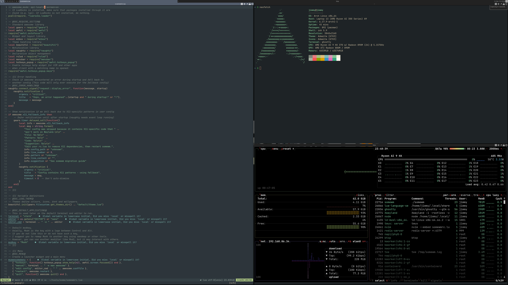
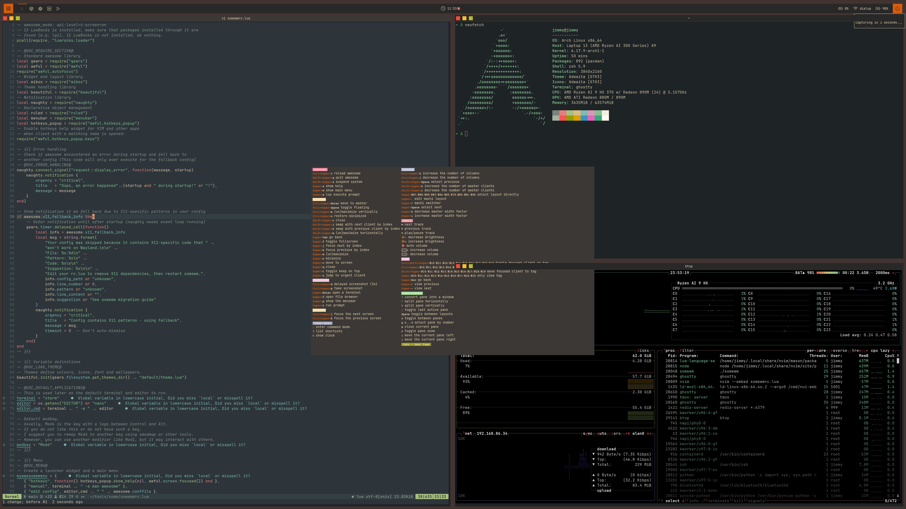

# somewm - AwesomeWM for Wayland

**somewm** is a Wayland compositor that brings AwesomeWM's Lua API to Wayland, built on [wlroots](https://gitlab.freedesktop.org/wlroots/wlroots). The goal is 100% compatibility with AwesomeWM's Lua configuration.

<p align="center">
  
  
</p>
<p align="center">
  <em>Default config (left) and a styled config (right)</em>
</p>

## Quick Start

### 1. Install Dependencies

**Arch Linux:**
```bash
# Note: lua51-lgi is required for LuaJIT (the default Lua for somewm)
sudo pacman -S wlroots0.19 luajit lua51-lgi cairo pango gdk-pixbuf2 \
    wayland-protocols libinput libxkbcommon
# Optional: XWayland support
sudo pacman -S xorg-xwayland libxcb
```

**Debian/Ubuntu (25.04+ or unstable):**
```bash
sudo apt install libwlroots-dev luajit lua-lgi libcairo2-dev \
    libpango1.0-dev libgdk-pixbuf-2.0-dev \
    wayland-protocols libinput-dev libxkbcommon-dev
# Optional: XWayland support
sudo apt install xwayland libxcb1-dev libxcb-icccm4-dev
```

**Fedora:**
```bash
sudo dnf install wlroots-devel luajit lua-lgi cairo-devel pango-devel \
    gdk-pixbuf2-devel wayland-protocols-devel libinput-devel \
    libxkbcommon-devel xcb-util-devel dbus-devel
# Optional: XWayland support
sudo dnf install xorg-x11-server-Xwayland libxcb-devel xcb-util-wm-devel
```

**NixOS:**

A `default.nix` is provided for building on NixOS:
```bash
nix-build
./result/bin/somewm
```

The included derivation sets up LGI and `GI_TYPELIB_PATH` automatically. For custom configurations or third-party Lua libraries, see the [NixOS section](#nixos) below.

> **Note:** wlroots 0.18+ is required. Debian stable and Ubuntu 24.04 LTS ship older versions - you'll need to [build wlroots from source](https://gitlab.freedesktop.org/wlroots/wlroots) first.

### 2. Build and Install

```bash
git clone https://github.com/trip-zip/somewm
cd somewm
make
sudo make install
```

The build will verify that LGI is correctly installed for your Lua version. If the check fails, you'll see instructions for which package to install.

For user-local installation (no root required):
```bash
make install-local
```

To add somewm to your display manager's session list:
```bash
sudo make install-session
```

### 3. Run

From your display manager, select "somewm" as your session.

Or from a TTY:
```bash
dbus-run-session somewm
```

With a startup command:
```bash
dbus-run-session somewm -s 'alacritty'
```

> **Note:** `dbus-run-session` ensures DBus services (notifications, media keys, etc.) work correctly. If you're already in a DBus session, you can run `somewm` directly.

## Configuration

somewm uses the same Lua configuration format as AwesomeWM. See the [AwesomeWM documentation](https://awesomewm.org/doc/api/) for the full API reference.

### Config Locations (checked in order)

1. `~/.config/somewm/rc.lua` - Your personal config
2. `~/.config/awesome/rc.lua` - AwesomeWM compatibility (use your existing config!)
3. System fallback - Default config installed with somewm

### Migrating from AwesomeWM

Your existing AwesomeWM config should work with minimal changes. somewm will automatically detect and skip configs that contain X11-specific code.

**Common X11 patterns to remove/replace:**

| X11 Pattern | Wayland Alternative |
|-------------|---------------------|
| `io.popen("xrandr")` | `screen:geometry()` or `screen.outputs` |
| `io.popen("xdotool")` | `awful.spawn()` or `client:send_key()` |
| `io.popen("xprop")` | `client.class` or `client.instance` |
| `awesome.register_xproperty()` | Not needed on Wayland |

If your config is skipped, somewm will show a notification explaining which X11 pattern was detected and suggest alternatives.

### Config Compatibility Check

Before migrating, you can scan your config for potential issues without starting the compositor:

```bash
somewm --check ~/.config/awesome/rc.lua
```

The scanner checks for:
- **Lua syntax errors** - Caught before execution
- **X11-specific APIs** - Functions like `awesome.get_xproperty()` that don't exist on Wayland
- **Blocking X11 tools** - Calls to `xrandr`, `xdotool`, `xprop` via `io.popen()` that would hang
- **Missing local modules** - `require()` statements for files that can't be found
- **Luacheck issues** - Code quality warnings (if luacheck is installed)

Issues are categorized by severity:
- **CRITICAL** - Will fail or hang on Wayland (must fix)
- **WARNING** - Needs a Wayland alternative
- **INFO** - May not work but won't break config

Example output:
```
somewm config compatibility report
====================================
Config: /home/user/.config/awesome/rc.lua

X CRITICAL:
  rc.lua:45 - io.popen with xrandr (blocks)
    → Use screen:geometry() or screen.outputs instead

! WARNING:
  rc.lua:112 - maim screenshot tool
    → Use awful.screenshot or grim instead

Summary: 1 critical, 1 warning
```

## Troubleshooting

### "No config found" error

Make sure you ran `make install` (or `make install-local`). Running somewm directly from the build directory won't work because Lua libraries aren't in the expected paths.

After installation, somewm searches for configs in this order:
1. `~/.config/somewm/rc.lua`
2. `~/.config/awesome/rc.lua`
3. `/etc/xdg/somewm/rc.lua` (system install) or `~/.local/etc/xdg/somewm/rc.lua` (local install)

### Config loads but crashes immediately

Enable debug logging to see what's happening:
```bash
somewm -d 2>&1 | tee somewm.log
```

Or with full wlroots debug output:
```bash
WLR_DEBUG=1 somewm 2>&1 | tee somewm.log
```

Look for lines containing `error loading` or `error executing` in the log.

### "X11 pattern detected" notification

Your config contains code that won't work on Wayland (e.g., calls to `xrandr`, `xdotool`). Edit your `rc.lua` to remove or replace these patterns, then restart somewm.

### Widgets not rendering / LGI not found

somewm requires LGI (Lua GObject Introspection bindings) for widget rendering. **The LGI package must match your Lua version.**

The build will check for LGI and fail with instructions if it's missing or wrong.

| Lua Version | Arch Linux | Debian/Ubuntu | Fedora |
|-------------|------------|---------------|--------|
| LuaJIT (default) | `lua51-lgi` | `lua-lgi` | `lua-lgi` |
| Lua 5.4 | `lua-lgi` | `lua-lgi` | `lua-lgi` |

If you have the wrong package, you'll see errors like:
```
module 'lgi' not found
```

For custom LGI locations, use the `-L` (or `--search`) flag:
```bash
somewm -L /usr/lib/lua/5.1
```

## Current Limitations

somewm is in active development. Most AwesomeWM functionality works, but some features are not yet implemented:

**Not Implemented:**
- Systray (system tray icons)
- `root.fake_input()` - Virtual input injection
- `root.cursor()` - Cursor theme changing
- X property APIs (`awesome.register_xproperty()`, etc.) - Not needed on Wayland
- Keybinding removal (`root.keys({})` to clear bindings)
- WM restart (Wayland architecture differs from X11)

**Partially Implemented:**
- Strut aggregation (single panel works, multiple panels may not)
- XKB toggle options (`grp:alt_shift_toggle`, etc.) don't trigger layout changes via key presses. Workaround: use keybindings that call `awesome.xkb_set_layout_group()`
- Scroll wheel bindings on root/clients

See the full list in the source code or open an issue if you encounter something that doesn't work.

## Uninstallation

```bash
# Remove system-wide installation
sudo make uninstall

# Remove user-local installation
make uninstall-local

# Remove session from display manager
sudo make uninstall-session
```

## NixOS

### Basic Usage

The included `default.nix` provides a complete derivation:

```bash
nix-build
./result/bin/somewm
```

Or with flakes:
```bash
nix build github:trip-zip/somewm
```

### GI_TYPELIB_PATH and Third-Party Libraries

On NixOS, GObject Introspection typelibs are isolated in `/nix/store` rather than system paths. The `default.nix` sets up `GI_TYPELIB_PATH` with common typelibs (pango, gdk-pixbuf, glib, gtk3).

**If you use third-party Lua libraries** (like [bling](https://github.com/BlingCorp/bling)), they may require additional typelibs. For example, bling's `app_launcher` widget requires GTK3 for icon theme lookups.

To add additional typelibs when packaging somewm, extend the wrapper:

```nix
postFixup = ''
  wrapProgram $out/bin/somewm \
    --prefix GI_TYPELIB_PATH : "${pkgs.gtk3}/lib/girepository-1.0" \
    --prefix GI_TYPELIB_PATH : "${pkgs.networkmanager}/lib/girepository-1.0" \
    # Add more as needed for your Lua libraries
'';
```

### Extra Lua Modules

To add additional Lua modules (like `luafilesystem`):

```nix
let
  luaEnv = pkgs.luajit.withPackages (ps: with ps; [
    lgi
    luafilesystem  # Add extra modules here
  ]);
in
# ... use luaEnv in buildInputs and wrapper
```

### Troubleshooting NixOS

**"Typelib file for namespace 'Gtk' not found"**

Add `pkgs.gtk3` to your `GI_TYPELIB_PATH`. This is commonly needed for bling and other libraries that use GTK for icon theme lookups.

**"module 'lgi' not found"**

Ensure `luaEnv` (with lgi) is in `buildInputs` and the wrapper adds it to `--search` paths:
```nix
--add-flags "--search ${luaEnv}/share/lua/5.1"
--add-flags "--search ${luaEnv}/lib/lua/5.1"
```

## Acknowledgements

- [AwesomeWM](https://github.com/awesomeWM/awesome) - The legendary window manager we're porting
- [wlroots](https://gitlab.freedesktop.org/wlroots/wlroots) - The Wayland compositor library
- [dwl](https://codeberg.org/dwl/dwl) - Initial reference for wlroots integration

## License

GPLv3. See [LICENSE](LICENSE) for details.
