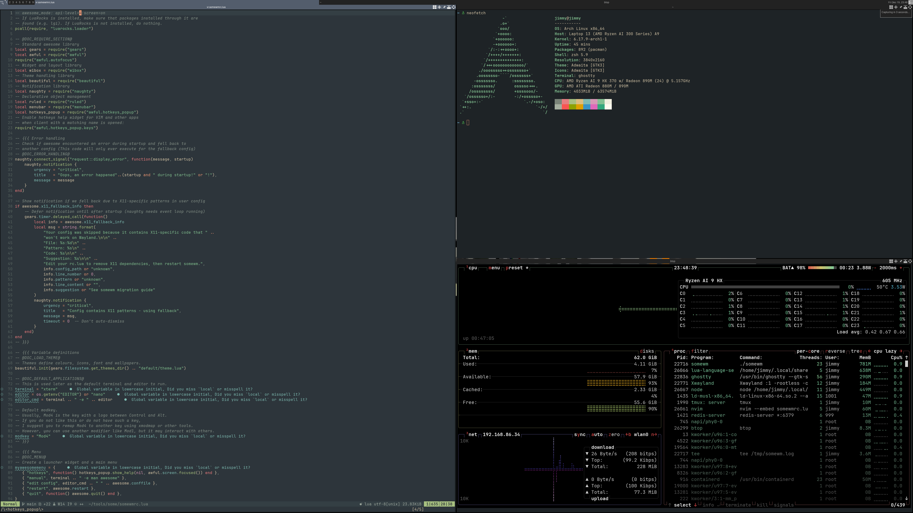
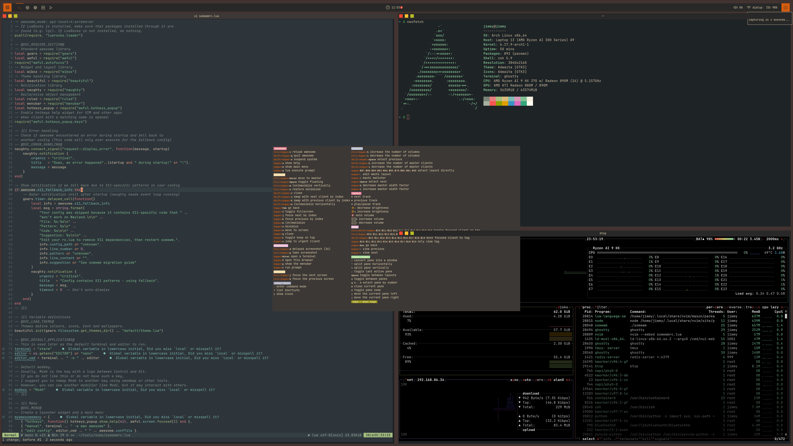

# somewm - AwesomeWM for Wayland

**somewm** is AwesomeWM ported to Wayland, built on [wlroots](https://gitlab.freedesktop.org/wlroots/wlroots) 0.19. It implements AwesomeWM's full Lua API - your `rc.lua`, widgets, and themes carry over with no changes. somewm supports LuaJIT as well as Lua 5.4, 5.3, 5.2, and 5.1 (AwesomeWM only supports PUC Lua).

<p align="center">
  
  
</p>
<p align="center">
  <em>Default config (left) and a styled config (right)</em>
</p>

## Highlights

Wayland enables features that weren't possible on X11:

- **LuaJIT and Lua 5.4 support** - AwesomeWM only supports PUC Lua; somewm also supports LuaJIT
- **Built-in lockscreen** - PAM-based session locking with theme integration (`Mod4 + Shift + Escape`)
- **`somewm-client`** - IPC CLI for controlling the compositor from scripts and the command line
- **Fractional scaling** - Per-output `screen.scale` for HiDPI displays
- **Input device configuration** - `awful.input` for pointer speed, tap-to-click, keyboard layout, etc.
- **Tag persistence** - Tags and client assignments survive monitor hotplug
- **Shadows** - Configurable window shadows via `beautiful`
- **Wallpaper caching** - Automatic GPU-side caching for wallpaper rendering
- **Idle and DPMS** - `awesome.set_idle_timeout()` and `awesome.dpms_off()`/`dpms_on()`

See the [full docs](https://somewm.org) for details.

## Install

**Arch Linux (AUR):**
```bash
yay -S somewm-git
```

**From source:**
```bash
git clone https://github.com/trip-zip/somewm
cd somewm
make
sudo make install
```

For Debian, Fedora, NixOS, and detailed instructions, see the [Installation Guide](https://somewm.org/getting-started/installation).

## Run

From your display manager, select "somewm" as your session.

Or from a TTY:
```bash
dbus-run-session somewm
```

See [First Launch](https://somewm.org/getting-started/first-launch) for configuration and migrating from AwesomeWM.

## Documentation

Full documentation at **[somewm.org](https://somewm.org)**:

- [Getting Started](https://somewm.org/getting-started/installation) - Installation, first launch, migration
- [Tutorials](https://somewm.org/tutorials/basics) - Keybindings, widgets, themes
- [Troubleshooting](https://somewm.org/troubleshooting) - Common issues and solutions

## Contributing

Contributions welcome! Please read the [Contributing Guide](CONTRIBUTING.md) first.

- Report bugs or request features via [Issues](https://github.com/trip-zip/somewm/issues)
- Questions and discussion at [Discussions](https://github.com/trip-zip/somewm/discussions)

## Acknowledgements

- [AwesomeWM](https://github.com/awesomeWM/awesome) - The GOAT window manager
- [wlroots](https://gitlab.freedesktop.org/wlroots/wlroots) - The Wayland compositor library
- [dwl](https://codeberg.org/dwl/dwl) - Initial reference for wlroots integration

## License

GPLv3. See [LICENSE](LICENSE) for details.
