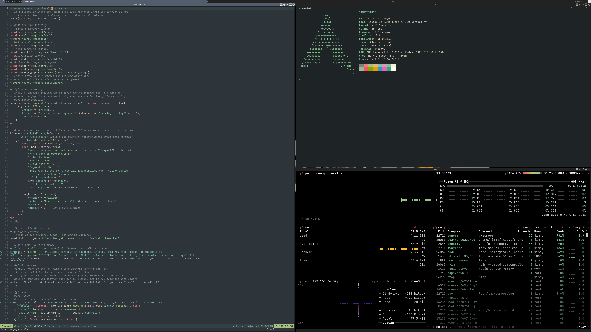
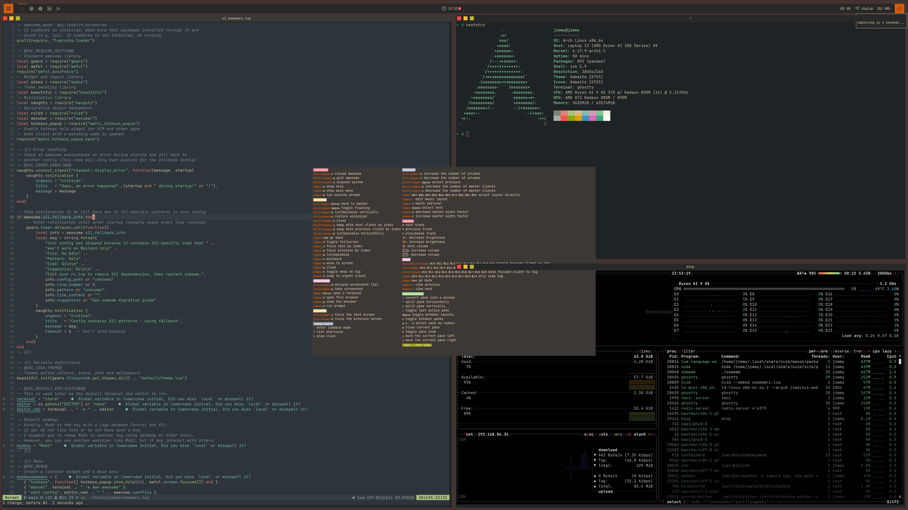

# somewm

A Lua framework for building your Wayland desktop. Layouts, widgets, keybindings, window rules, notifications, status bars, etc.

SomeWM has a complete widget system, a signal-driven object model, and a compositor runtime, all wired together so every piece can talk to every other piece. Write a widget that reacts to window focus changes. Build a layout that adapts to screen geometry. Script your entire workflow from `rc.lua` or from the command line.

Built on [wlroots](https://gitlab.freedesktop.org/wlroots/wlroots) 0.19 or 0.20. Compatible with [AwesomeWM's](https://github.com/awesomeWM/awesome) Lua API - existing configs, widgets, and themes carry over.

> **This branch (`main`) is 2.0-dev.** If you want 100% AwesomeWM parity, use the [`release/1.4`](https://github.com/trip-zip/somewm/tree/release/1.4) branch or install `somewm` from the [AUR](https://aur.archlinux.org/packages/somewm).

<p align="center">
  
  
</p>
<p align="center">
  <em>Default config (left) and a styled config (right)</em>
</p>

## Install

**Arch Linux (AUR):**
```bash
yay -S somewm      # Stable 1.4
yay -S somewm-git  # Development (this branch)
```

**From source:**
```bash
git clone https://github.com/trip-zip/somewm
cd somewm
make
sudo make install
```

For Debian, Fedora, NixOS, and detailed instructions, see the [Installation Guide](https://somewm.org/docs/next/getting-started/installation).

**wlroots version.** The build uses wlroots 0.20 if you already have it installed. If
not, it picks 0.20 when your wayland-server, libdrm, xkbcommon, wayland-protocols and
pixman are new enough to build it, and 0.19 otherwise. Older stable distributions
(Debian 13, Ubuntu 24.04) fall into the 0.19 case. `meson setup` prints which version it
chose, and when it falls back to 0.19 it names the dependencies that came up short.

Override the choice with `meson setup build -Dwlroots_version=0.19` (or `0.20`). If
wlroots is not installed, the matching version is built from `subprojects/`.

The 0.19 path exists for these older distributions and will be dropped once they ship
wlroots 0.20 or the dependency versions it needs.

## Run

From a TTY:
```bash
dbus-run-session somewm
```

From a display manager, select "somewm" as your session.

Systemd units are also included for session management.

Validate your config before switching:
```bash
somewm --check
```

See [First Launch](https://somewm.org/docs/next/getting-started/first-launch) for configuration and migrating from AwesomeWM.

## Documentation

Full documentation at **[somewm.org](https://somewm.org)**:

- [Getting Started](https://somewm.org/docs/next/getting-started/installation) - Installation, first launch, migration
- [Tutorials](https://somewm.org/docs/next/tutorials/basics) - Keybindings, widgets, themes
- [Wayland Protocols](https://somewm.org/docs/next/reference/wayland-protocols) - Protocols somewm advertises to clients
- [Troubleshooting](https://somewm.org/docs/next/troubleshooting) - Common issues and solutions

## Contributing

Contributions welcome! Please read the [Contributing Guide](CONTRIBUTING.md) first.

- Report bugs or request features via [Issues](https://github.com/trip-zip/somewm/issues)
- Questions and discussion at [Discussions](https://github.com/trip-zip/somewm/discussions)

## Acknowledgements

- [AwesomeWM](https://github.com/awesomeWM/awesome) - The GOAT window manager
- [wlroots](https://gitlab.freedesktop.org/wlroots/wlroots) - The Wayland compositor library
- [dwl](https://codeberg.org/dwl/dwl) - Initial reference for wlroots integration

## License

GPLv3. See [LICENSE](LICENSE) for details.
